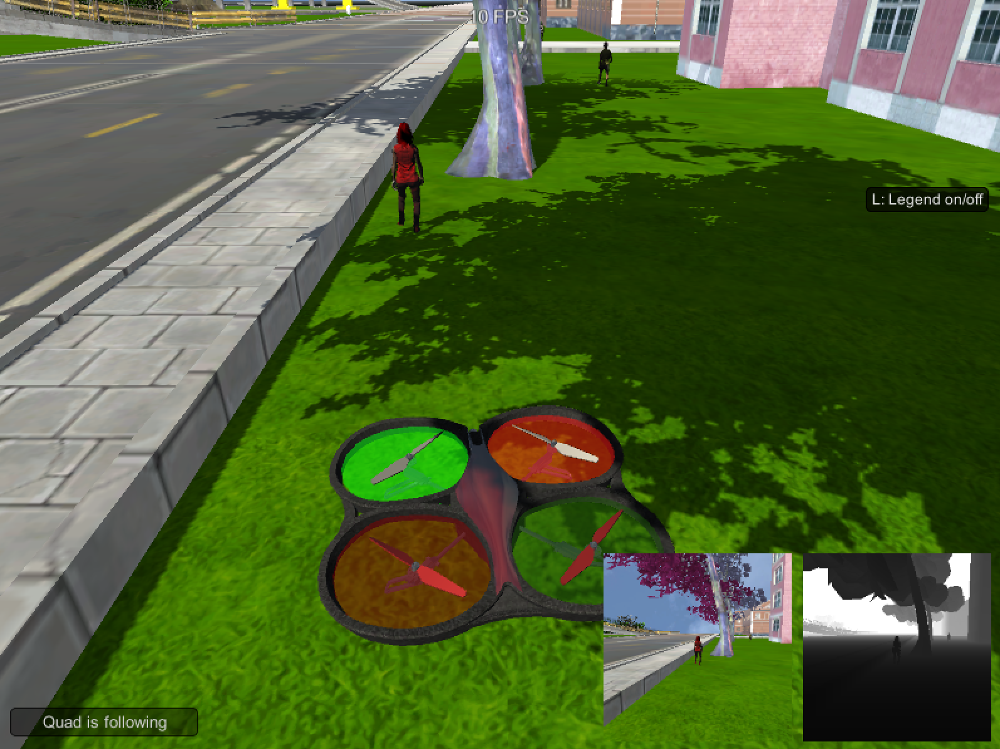

# Follow Me - Deep Learning follower drone



# Description

The Follow Me project goal is to create a `Fully Convolutional Network` (FCN for short) in `Tensorflow` to teach the drone recognizing and then following a specific person through a simulated environment. The learning was computed using AWS with the support of Udacity.

The data images I used were given for the project.

To see how good the model works, an `IOU` metric is introduced (Intersection over Union). This way I could compare the prediction to the ground truth.

## Important project files

- [model_training.ipynb](https://github.com/lukzmu/udacity-robotics-drone/blob/master/code/model_training.ipynb)
- [model.h5]()

## Tools used

- Python 3.6,
- Tensorflow,
- Jupyter Notebooks,
- QuadSim.

# Network Architecture


For my network I used three `Encoder Layers`, one `1x1 Convolution Layer` and three (the same as encoders) `Decoder Layers`, connected by `Skip Connections`. From the references I have read, that this is a popular solution due to the fact, that it is faster than previous methods. I will explain how it works in the following sections.

## What is a Fully Convolutional Network?

`Fully Convolutional Network` is a neural network that typically consists of convolution layers and a soft max function. It allows us to not only recognize objects, but also preserves spatial information over the entire network, that will help us achieve the question of *"where is the object?"*. `Fully Convolutional Networks` doen't care about the size of the input, so they will work on images of any size. 

### Techniques used in FCN

- Replace fully connected layers with convolutional layers,
- Upsampling using transposed convolutional layers,
- Skip Connections.

### What are Skip Connections?


`Skip Connections` allow to preserve data that would normally be lost due to narrowing down the scope of an image. Due to that fact, the network is capable of making more precise decisions about object recognition.

## Encoding and Decoding

`Encoding` layers are responsible for pooling the resources (down-sampling images). We do this in order to generalize images that weren't going through the algorithm yet, which results in loosing spatial data.

The `filters` parameter defines the size/depth of the output layer.

```python
def encoder_block(input_layer, filters, strides):
    return separable_conv2d_batchnorm(input_layer, filters, strides)
```

`Decoding` on the other hand is there, to "get back" the spatial data we lost during `Encoding`.

The decoder block is comprised of three parts:

- A bilinear upsampling layer using the `upsample_bilinear()` function,
- A layer concatenation step,
- Two additional separable convolution layers to extract spatial information.

```python
def decoder_block(small_ip_layer, large_ip_layer, filters):    
    # Upsample the small input layer using the bilinear_upsample() function.
    unsampled_layer = bilinear_upsample(small_ip_layer)
    
    # Concatenate the upsampled and large input layers using layers.concatenate
    concatenated_layer = layers.concatenate([unsampled_layer, large_ip_layer])
    
    # Add some number of separable convolution layers
    first_layer = separable_conv2d_batchnorm(concatenated_layer, filters)
    output_layer = separable_conv2d_batchnorm(first_layer, filters)
    
    return output_layer
```

## 1x1 Convolution Layer

When replacing a fully connected layer with `1x1 convolutional layers` our output would be a 4-dimensional tensor that preserves spatial information. Due to that, we can feed images of any size into a trained network.

It consists of filters of dimensions:

- `1x1xfilter_size` (HxWxD),
- `stride = 1`,
- zero padding.

## Obtaining Hyper Parameters

I have obtained the `Hyper Parameters` by trial and error. I have added additional values `train_count` and `valid_count` that helped me get the steps value for training and validation with the use of `batch_size`.

I didn't see much difference in the speed of calculations when changing the `workers` parameter, so I used 10.

| Parameter | Value | Description |
| :-- | :-- | :-- |
| **Training Count** | 4131 | The amount of images available for training |
| **Validation Count** | 2368 | The amount of images available for validation |
| **Learning Rate** | 0.001 | The learning rate is responsible for the speed of learning. Too big or too small value could make it impossible to get the desired output. I took the value as suggested in the `Adam` optimizer.|
| **Batch Size** | 50 | How many images should be taken at a time. Through trial and error, you can set the correct ammount of images to fit your computer capabilities. |
| **Number of Epochs** | 20 | How many iterations should be made on the same data. High number can overfit the data, while a small value would underfit it. |
| **Steps per Epoch** | `train_count / batch_size` | Training steps taken as suggested in the training. |
| **Validation steps** | `valid_count / batch_size` | Validation steps taken as suggested in the training. |
| **Workers** | 10 | Describes how many threads will be working on the algorithm.|

## How was the network created in Tensorflow?

The model was created by the `fcn_model(inputs, num_classes)` function.

```python
def fcn_model(inputs, num_classes):    
    # Set depth, the most common usages is 32 or 64.
    depth = 64
    
    # Add Encoder Blocks
    print("Adding Encoder Blocks...")
    encoder_block_1 = encoder_block(inputs, depth, 2)
    print(encoder_block_1)
    encoder_block_2 = encoder_block(encoder_block_1, depth * 2, 2)
    print(encoder_block_2)
    encoder_block_3 = encoder_block(encoder_block_2, depth * 4, 2)
    print(encoder_block_3)

    # Add 1x1 Convolution layer using conv2d_batchnorm().
    # The 1x1 Convolution requires kernel_size and strides to be 1.
    print("Adding Convolution Layer...")
    conv_layer = conv2d_batchnorm(encoder_block_3, depth * 4, kernel_size = 1, strides = 1)
    print(conv_layer)
    
    # Add the same number of Decoder Blocks as the number of Encoder Blocks
    print("Adding Decoder Blocks...")
    decoder_block_1 = decoder_block(conv_layer, encoder_block_2, depth * 4)
    print(decoder_block_1)
    decoder_block_2 = decoder_block(decoder_block_1, encoder_block_1, depth * 2)
    print(decoder_block_2)
    decoder_block_3 = decoder_block(decoder_block_2, inputs, depth)
    print(decoder_block_3)
    
    # Creating the result
    print("Creating result...")
    result = layers.Conv2D(num_classes, 1, activation='softmax', padding='same')(decoder_block_3)
    print(result)

    return result
```

Each step had a `print()` to see what data is created, here you can see the output:

```bash
Adding Encoder Blocks...
Tensor("batch_normalization/batchnorm/add_1:0", shape=(?, 80, 80, 64), dtype=float32)
Tensor("batch_normalization_2/batchnorm/add_1:0", shape=(?, 40, 40, 128), dtype=float32)
Tensor("batch_normalization_3/batchnorm/add_1:0", shape=(?, 20, 20, 256), dtype=float32)
Adding Convolution Layer...
Tensor("batch_normalization_4/batchnorm/add_1:0", shape=(?, 20, 20, 256), dtype=float32)
Adding Decoder Blocks...
Tensor("batch_normalization_6/batchnorm/add_1:0", shape=(?, 40, 40, 256), dtype=float32)
Tensor("batch_normalization_8/batchnorm/add_1:0", shape=(?, 80, 80, 128), dtype=float32)
Tensor("batch_normalization_10/batchnorm/add_1:0", shape=(?, 160, 160, 64), dtype=float32)
Creating result...
Tensor("conv2d_2/truediv:0", shape=(?, 160, 160, 3), dtype=float32)
```

# Results and Discussion

Below you can see the result of 20 epochs of training:


Due to the fact, that I didn't have access to AWS (over a week of waiting for the instance to work and contacting support), I reduced the dataset by half to run it on my personal computer. I could do this or decrease the number of neural network layers, but I didn't want to loose the possibility to train in more details. Moreover I think that the `learning_rate` I chose was too big as you can see some overfitting. Probably a better rate would be `0.002` or `0.001`. The end result still is good, as the final grade is `0.39313740942932973`.


# Summary

In this project I have implemented a Fully Convolutional Network using `Tensorflow` for `Python 3.6`. The jupyter notebook was deployed on Amazon Cloud Services and produced a working solution for following people in a simulated environment.

The presented neural network obtains a final grade of `0.39313740942932973`, which is a good result for detecting given objects. The model is trained on `people` data, so while it is great just for that, it won't identify other objects like cats or cars. To accomplish that, we would need to train our model on different data (for example images of cats). 

# Future Enhancements

Future enhancements for this project could include making a deeper network, which could recognize more details. This could allow to see people from a greater distance (this is often used in Autonomous Cars).

Moreover, we could actually implement other objects (like mentioned cats or cars), so that the drone responds more intelligently to it's surroundings (we wouldn't like to get too close to a cat... they like hurting drones).

Moreover I would like to check the trained neural network on the full dataset, which I will try out soon to get a better result.

# References

- http://www.deeplearningbook.org/
- https://machinelearningmastery.com/adam-optimization-algorithm-for-deep-learning/
- https://people.eecs.berkeley.edu/~jonlong/long_shelhamer_fcn.pdf
- https://towardsdatascience.com/image-augmentation-for-deep-learning-histogram-equalization-a71387f609b2
- http://cv-tricks.com/image-segmentation/transpose-convolution-in-tensorflow/
- https://arxiv.org/pdf/1603.07285.pdf
- https://www.youtube.com/watch?v=ByjaPdWXKJ4
- https://blog.keras.io/building-powerful-image-classification-models-using-very-little-data.html
