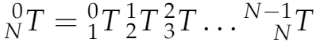
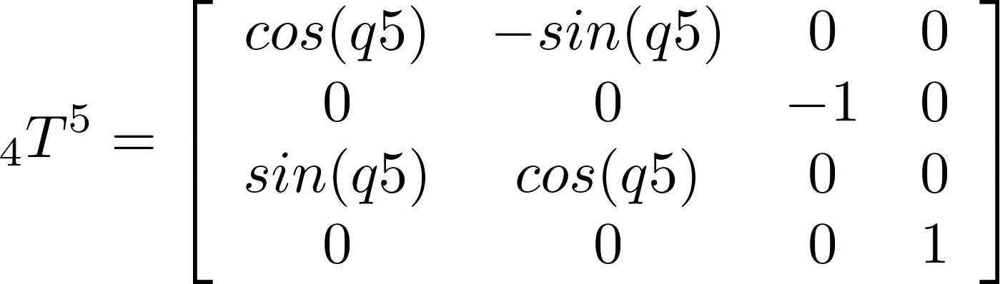

## Project: Kinematics Pick & Place

---

## [Rubric](https://review.udacity.com/#!/rubrics/972/view) Points

---
### Writeup

The required files for the project:

- [IK_server.py](https://github.com/lukzmu/udacity-robotics-arm/blob/master/IK_server.py)


### Kinematic Analysis
#### 1. Run the forward_kinematics demo and evaluate the kr210.urdf.xacro file to perform kinematic analysis of Kuka KR210 robot and derive its DH parameters.

---

Running the demo allowed me to get an insight on the project. Using the `rviz` software I could check how various parameters change in different movement frames. `Gazebo` provided me with an overview of the environment and was showing me the actual movement of the robotic arm.

#### 2. Using the DH parameter table you derived earlier, create individual transformation matrices about each joint. In addition, also generate a generalized homogeneous transform between base_link and gripper_link using only end-effector(gripper) pose.
---

##### Creating the DH parameter table
Here you can see the project schematic for Kuka KR210 axis and length values for the joints. I will use the symbols presented here in the following description and compare them to the way I placed them in code.


Here is a description of the symbols used:

Definition | In code | Description
--- | --- | ---
`alpha(i-1)` | `ap` | The twist angle of the joint between `z-1` and `z` about the `x-1` axis
`a(i-1)` | `a` | The link length between joints from `z-1` to `z` along `x-1` axis
`d(i-1)` | `d` | The link offset between joints from `x-1` to `x` along `z` axis
`theta(i)` | `q` | The angle of the joint between `x-1` and `x` about `z` axis

This is how it looks in code:

```python
d1, d2, d3, d4, d5, d6, d7 = symbols('d1:8')
a0, a1, a2, a3, a4, a5, a6 = symbols('a0:7')
ap0, ap1, ap2, ap3, ap4, ap5, ap6 = symbols('ap0:7')
q1, q2, q3, q4, q5, q6, q7 = symbols('q1:8')
```

What we need to know to create the DH parameter table:

- `Links` describe what frames we take into consideration,
- `a` and `d` values, can sometimes be taken from the robot specification,
- The `alpha` and `a` are equal to 0, when `z-1` and `z` are colinear,
- When `x-1` and `x` are parallel, last column will be filled with `theta`,
- If `theta` is 0, while `x` axes are not parallel, the result is `theta + non-constant offset`.

The DH parameter table:

Links | alpha(i-1) | a(i-1) | d(i-1) | theta(i)
--- | --- | --- | --- | ---
0->1 | 0 | 0 | 0.75 | theta1
1->2 | -pi / 2 | 0.35 | 0 | theta2 - pi / 2
2->3 | 0 | 1.25 | 0 | theta3
3->4 |  -pi / 2 | -0.054 | 1.5 | theta4
4->5 | pi / 2 | 0 | 0 | theta5
5->6 | -pi / 2 | 0 | 0 | theta6
6->EE | 0 | 0 | 0.303 | 0

This is how the DH parameter table is represented in code:

```python
# Create Modified DH parameters
DH = {
	ap0: 0,      a0: 0,      d1: 0.75,    q1: q1,
	ap1: -pi/2,  a1: 0.35,   d2: 0,       q2: q2 - pi/2,
	ap2: 0,      a2: 1.25,   d3: 0,       q3: q3,
	ap3: -pi/2,  a3: -0.054, d4: 1.5,     q4: q4,
	ap4: pi/2,   a4: 0,      d5: 0,       q5: q5,
	ap5: -pi/2,  a5: 0,      d6: 0,       q6: q6,
	ap6: 0,      a6: 0,      d7: 0.303,   q7: 0
      }
```

##### Transform matrices

To purpose of transforming matrices is to get a transform between the base link and the end effector. We can achieve it by getting transforms for each link in the chain from start to end. This is represented by the following equation:



The total transform between adjacent links is given by the following equation:


I have created the `TF()` function that is used to create the individual transformation matrices based on the previous equation. Below you can see the usage:

```python
# Define Modified DH Transformation matrix
def TF(ap, a, d, q):
	return Matrix([[ cos(q), -sin(q), 0, a],
		    [sin(q)*cos(ap), cos(q)*cos(ap), -sin(ap), -sin(ap)*d],
		    [sin(q)*sin(ap), cos(q)*sin(ap), cos(ap), cos(ap)*d],
		    [0, 0, 0, 1]]).subs(DH)

# Create individual transformation matrices
T01 = TF(ap0, a0, d1, q1)
T12 = TF(ap1, a1, d2, q2)
T23 = TF(ap2, a2, d3, q3)
T34 = TF(ap3, a3, d4, q4)
T45 = TF(ap4, a4, d5, q5)
T56 = TF(ap5, a5, d6, q6)
T6E = TF(ap6, a6, d7, q7)
```

Here you can see all the transformation matrices calculated using the parameters from the DH table presented above.

      

This gives us everything that we need to calculate the transform matrix from frame 0, to the end effector like this:

```
T0E = T01 * T12 * T23 * T34 * T45 * T56 * T6E
T0E = simplify(T0E)
```

#### 3. Decouple Inverse Kinematics problem into Inverse Position Kinematics and inverse Orientation Kinematics; doing so derive the equations to calculate all individual joint angles.
---

##### Rotation matrices
In this section I will show, how I calculate `theta` values for the joint angles.

I start by defining the **rotation matrices** as functions, to make "life easier". I am using the transform matrices taken from the theory for the project:

```python
def rot_roll(r):
    return Matrix([[1,      0,       0],
		           [0, cos(r), -sin(r)],
		           [0, sin(r),  cos(r)]])

def rot_pitch(p):
    return Matrix([[cos(p),  0, sin(p)],
			       [0,       1,      0],
			       [-sin(p), 0, cos(p)]])

def rot_yaw(y):
    return Matrix([[cos(y), -sin(y), 0],
			       [sin(y),  cos(y), 0],
			       [0,            0, 1]])
```

##### Gazebo vs DH Parameters

Now I'm generating an error matrix to compensate for the difference between DH parameters and Gazebo. The error is created because Gazebo gives us reference frames in Unified Robot Description Format (URDF) instead of DH parameters.

To compensate for that, we need to perform a 180 degree counter-clockwise rotation around the `z axis` and a 90 degree clockwise rotation around the `y axis`.

```python
rot_ee = rot_yaw(yaw) * rot_pitch(pitch) * rot_roll(roll)
rot_err = rot_yaw(yaw).subs(yaw, radians(180)) * rot_pitch(pitch).subs(pitch, radians(-90))
rot_ee = rot_ee * rot_err    	    
EE = Matrix([[px], [py], [pz]])
WC = EE - (0.303) * rot_ee[:,2]
```

##### Calculating angles

Calculating `theta1` is the easiest step. We need to project our values on the ground plane:


We are using the values from our compensated matrix between DH parameters and Gazebo:

```python
theta1 = atan2(WC[1], WC[0])
```

This is the code used for `theta2` and `theta3` calculation. I start by getting side values for calculating the geometry:

- `side_a` and `side_c` are gathered from the DH parameter table,
- I calculate `side_b` by passing values from my compensated `WC` matrix and DH parameters to the euclidean distance equation as seen here:


You can visualize side_b this way:


This is how it is represented in code with compensation for error:
```python
side_a = 1.501
side_b = sqrt(pow((sqrt(WC[0] * WC[0] + WC[1] * WC[1]) - 0.35), 2) + pow((WC[2] - 0.75), 2))
side_c = 1.25
```

Having this, we can now calculate the angles needed to calculate thetas. This is possible thanks to the **Cosine Law** as presented below:


```
angle_a = acos((side_b * side_b + side_c * side_c - side_a * side_a) / (2 * side_b * side_c))
angle_b = acos((side_a * side_a + side_c * side_c - side_b * side_b) / (2 * side_a * side_c))
angle_c = acos((side_a * side_a + side_b * side_b - side_c * side_c) / (2 * side_a * side_b))
```

When we calculated the angles, we can now use the values taken from the DH parameters and the compensated transform and calculate the missing thetas:

```
theta2 = pi / 2 - angle_a - atan2(WC[2] - 0.75, sqrt(WC[0] * WC[0] + WC[1] * WC[1]) - 0.35)
theta3 = pi / 2 - (angle_b + 0.036)
```

We can move now to the calculations for `theta4` to `theta6`.

We start by creating values for the rotation between **joint 3** and the gripper, result stored as `R03`. `R36` is the transposed matrix multiplied by the `rot_ee` matrix we calculated earlier for gazebo error handling.

```
R03 = T01[0:3, 0:3] * T12[0:3, 0:3] * T23[0:3, 0:3]
R03 = R03.evalf(subs={q1: theta1, q2: theta2, q3: theta3})
R36 = R03.T * rot_ee
```

The last thetas are calculated the following way using `R36` we calculated a moment ago.

```python
# sin(q4) and cos(q4)
theta4 = atan2(R36[2,2], -R36[0,2])

# sin(q5) and cos(q5)
theta5 = atan2(
	sqrt(R36[0,2]*R36[0,2] + R36[2,2]*R36[2,2]),
	R36[1,2])

# sin(q6) and cos(q6)
theta6 = atan2(-R36[1,1], R36[1,0])
```

### Project Implementation

#### 1. Fill in the `IK_server.py` file with properly commented python code for calculating Inverse Kinematics based on previously performed Kinematic Analysis. Your code must guide the robot to successfully complete 8/10 pick and place cycles. Briefly discuss the code you implemented and your results.
---

I did the project in its basic form: to pass the minimum requirements. I plan to change how `theta` values are calculated in the nearest future, because now its far away from optimum and I'm not really happy with them (the biggest plus is, that it's working). The project was quite hard for me, because of the mathematics background nature.

I tried making the code as clean as possible and used all the methods described in the theory section of the project. I have created some functions to decrease the amount of code and make it reusable.

As for the results: the robot successfully places the object in the bin most of the times. The minus is that it takes ages because of how I calculated the thetas (I went the most straightforward way possible).

I found the project really challenging and fun, since it was stepping out of my comfort zone (and into lot's of math calculations).
