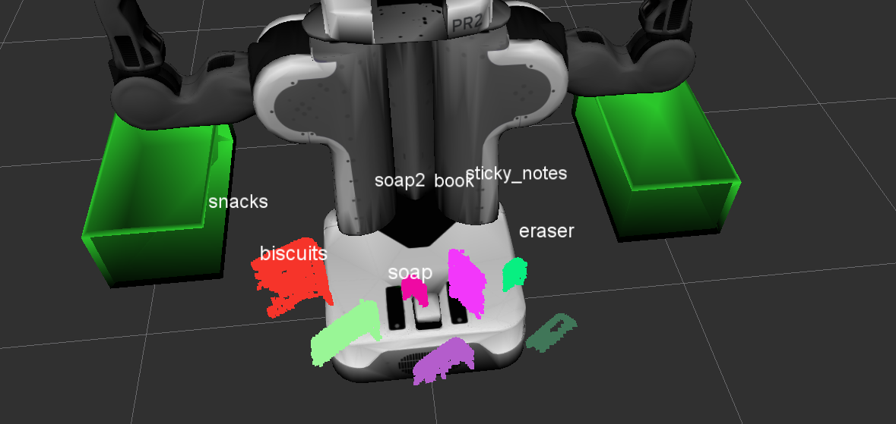
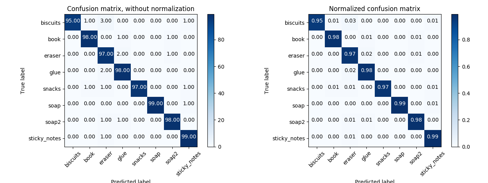
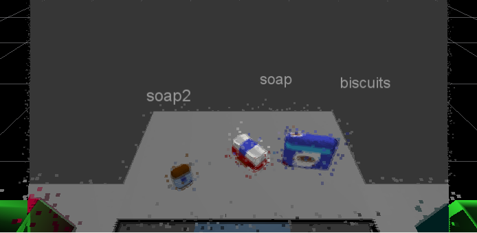
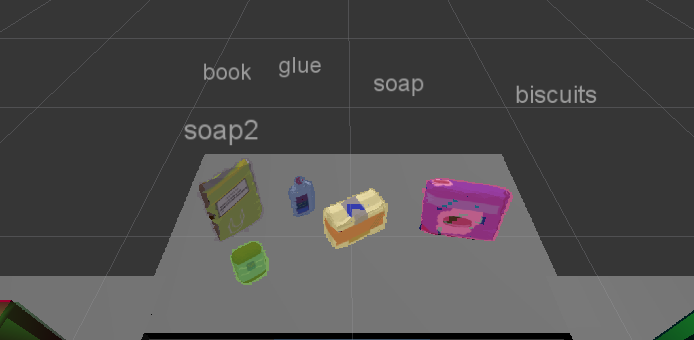
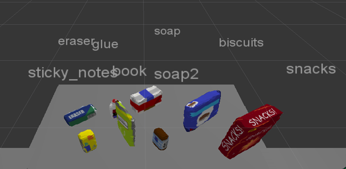

# Project: Perception Pick & Place

---

## [Rubric](https://review.udacity.com/#!/rubrics/1067/view) Points

**Important project files:**

- [Main project file](https://github.com/lukzmu/udacity-robotics-perception/blob/master/pr2_robot/scripts/project_template.py)
- [features.py](https://github.com/lukzmu/udacity-robotics-perception/blob/master/training/features.py)
- [capture_features.py](https://github.com/lukzmu/udacity-robotics-perception/blob/master/training/capture_features.py)
- [train_svm.py](https://github.com/lukzmu/udacity-robotics-perception/blob/master/training/train_svm.py)

**Result files:**

- [output_1.yaml](https://github.com/lukzmu/udacity-robotics-perception/blob/master/pr2_robot/scripts/output_1.yaml)
- [output_2.yaml](https://github.com/lukzmu/udacity-robotics-perception/blob/master/pr2_robot/scripts/output_2.yaml)
- [output_3.yaml](https://github.com/lukzmu/udacity-robotics-perception/blob/master/pr2_robot/scripts/output_3.yaml)

---

**The project can be divided into four stages:**

- Calibration, filtering and segmentation,
- Clustering for segmentation,
- Object recognition,
- Creating the yaml files.

In the following sections, I will introduce each one of those in detail.

# Calibration, filtering and segmentation

The first step was to create a `Point Cloud` from the RGBD camera mounted on the PR2 robot. The data was received from the `/pr2/world/points` topic in ROS, which contained noise (the data wasn't clear). I had to calibrate and filter the data, to get a satisfying result. Here are the techniques I used:

### Statistical Outlier Filtering


The **Statistical Outlier Filter** performs a statistical analysis in the neighborhood of each point, and remove those points which do not meet a certain criteria. By assuming a Gaussian distribution, all points whose mean distances are outside of an interval defined by the global distances mean+standard deviation are considered to be outliers and removed from the point cloud.

```python
def statistical_outlier_filtering(data, k=20, thresh=0.5):
    sof = data.make_statistical_outlier_filter()
    sof.set_mean_k(k)
    sof.set_std_dev_mul_thresh(thresh)
    return sof.filter()
```

### Voxel Grid Downsampling

A voxel grid filter allows you to downsample the data by taking a spatial average of the points in the cloud confined by each voxel. You can adjust the sampling size by setting the voxel size along each dimension. The set of points which lie within the bounds of a voxel are assigned to that voxel and statistically combined into one output point. The resulting Point Cloud is `smaller`.

```python
def voxel_grid_downsampling(data, leaf_size=0.01):
    vox = data.make_voxel_grid_filter()
    vox.set_leaf_size(leaf_size, leaf_size, leaf_size)
    return vox.filter()
```

### Pass Through Filtering


The Pass Through Filter works much like a cropping tool, which allows you to crop any given 3D point cloud by specifying an axis with cut-off values along that axis. The region you allow to pass through, is often referred to as region of interest.

```python
def passthrough_filter(data, axis, min, max):
    passthrough = data.make_passthrough_filter()
    passthrough.set_filter_field_name(axis)
    passthrough_z.set_filter_limits(min, max)
    return passthrough.filter()
```

In the project, the passthrough filter was used twice. First in the `z` axis, and next in the `x` axis (to take care of the place boxes).

```python
pcl_data = passthrough_filter(pcl_data, 'z', 0.6, 1.1)
pcl_data = passthrough_filter(pcl_data, 'x', 0.3, 1.0) # Remove boxes
```

### RANSAC algorithm

The RANSAC algorithm assumes that all of the data in a dataset is composed of both inliers and outliers, where inliers can be defined by a particular model with a specific set of parameters, while outliers do not fit that model and hence can be discarded. Like in the example below, we can extract the outliners that are not good fits for the model.

In our case `inliners` are the objects placed on the table, while `outliners` include the table and everything else.

```python
def ransac_segmentation(data, max_distance=0.01):
    ransac = data.make_segmenter()
    ransac.set_model_type(pcl.SACMODEL_PLANE)
    ransac.set_method_type(pcl.SAC_RANSAC)
    ransac.set_distance_threshold(max_distance)
    return ransac.segment()

# Getting the objects and table example
inliners, coefficients = ransac_segmentation(data)
objects = data.extract(inliners, negative=True) # Please notice the negative value
table = data.extract(inliners, negative=False) # And here... :)
```

# Clustering for segmentation

Once we get the Point Clouds associated with objects, we can begin the clustering and segmentation process. We need this, to be able to recognize objects placed on the table.

he k-d tree data structure is used in the Euclidian Clustering algorithm to decrease the computational burden of searching for neighboring points. While other efficient algorithms/data structures for nearest neighbor search exist, PCL's Euclidian Clustering algorithm only supports k-d trees.

```python
def euclidean_clustering(white_cloud, tolerance=0.01, min=30, max=5000):
    tree = white_cloud.make_kdtree()
    ec = white_cloud.make_EuclideanClusterExtraction()
    ec.set_ClusterTolerance(tolerance)
    ec.set_MinClusterSize(min)
    ec.set_MaxClusterSize(max)
    ec.set_SearchMethod(tree)
    return ec.Extract()
```

I found out that using the above values presented good results for clustering even the smallest objects (for example `glue` in the 3rd world scene).

Once we have that going, we can visualize the cluster cloud in a way, that is readable to the human eye:

```python
def get_cluster_cloud(cluster_indices, white_cloud):
    cluster_color = get_color_list(len(cluster_indices))
    color_cluster_point_list = []

    for j, indices in enumerate(cluster_indices):
        for i, indice in enumerate(indices):
            color_cluster_point_list.append([white_cloud[indice][0],
                                             white_cloud[indice][1],
                                             white_cloud[indice][2],
                                             rgb_to_float(cluster_color[j])])
    cluster_cloud = pcl.PointCloud_PointXYZRGB()
    cluster_cloud.from_list(color_cluster_point_list)
    return cluster_cloud
```

Which results in this (notice how each cluster has a different color):



# Object recognition

Before doing any actual object recognition, I had to create a labeled dataset first. I have used the [capture_features.py](https://github.com/lukzmu/udacity-robotics-perception/blob/master/training/capture_features.py) script with `100 iterations` for each object to get a good feature list. The result was saved into `training_set.sav`.

```
Features in Training Set: 800
Invalid Features in Training set: 0
Scores: [ 0.96875  0.9875   0.975    0.98125  0.96875]
Accuracy: 0.98 (+/- 0.01)
accuracy score: 0.97625
```

Next I have run the [train_svm.py](https://github.com/lukzmu/udacity-robotics-perception/blob/master/training/train_svm.py) script. SVMs work by applying an iterative method to a training dataset, where each item in the training set is characterized by a feature vector and a label. In the image above, each point is characterized by just two features, A and B. The color of each point corresponds to its label, or which class of object it represents in the dataset. Below you can see the **Confusion Matrix** with and without normalization.



#### Recognition results

##### Test World 1 (3/3 items)



##### Test World 2 (5/5 items)



##### Test World 3 (8/8 items)



# Creating the yaml files

After the items are recognized, we need to send the information to the PR2 robot. We use this by sending the yaml dictionary to the `pick_place_routine` method.

We need to pass the following values:

- **Test scene number**, depending on what world we are currently,
- **Arm name** from the `rospy.get_param('/dropbox')`,
- **Pickup pose** position taken from the cloud centroid:
   ```
   cloud = ros_to_pcl(object.cloud).to_array()
   x, y, z = np.mean(cloud, axis=0)[:3]
   pick_pose.position.x = np.asscalar(x)
   pick_pose.position.y = np.asscalar(y)
   pick_pose.position.z = np.asscalar(z)
   ```
- **Place pose** of the box:
   ```
   x, y, z = param['position']
   place_pose.position.x = np.float(x)
   place_pose.position.y = np.float(y)
   place_pose.position.z = np.float(z)
   ```

   # Discussion

   The presented methods allowed me to successfully recognize the objects in 3 test worlds. I had to change the calibration values for filters from the exercises, because they weren't giving me satisfying results - mostly because of the noise present in the PR2 `/pr2/world/points` topic.

   It amazed me, that I had to do so many feature runs (100 iterations), before I got good results that allowed recognition of items. With previous try, which was 50 iterations, some items weren't recognized at all.

   Also `Test World 1` required a higher value for the Euclidean Clustering minimum cluster size - 100 instead of 30 - compared to `Test World 2 and 3`.

   What can be improved in future work:

   - The way the `passthrough` filter is handled, won't fit other camera settings,
   - When the objects would be closer, there would be problems with creation of clusters,
   - Adding new (not learned) objects would require running the SVM again,
   - The initial point cloud is quite big, reducing the speed of the algorithm.
