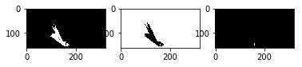

## Project: Search and Sample Return
**Robotics Software Engineer Nanodegree**

---

## [Rubric](https://review.udacity.com/#!/rubrics/916/view) Points

**Required files for project submission:**

- [Jupyter Notebook with test code](https://github.com/lukzmu/udacity-robotics-rover/blob/master/code/Rover_Project_Test_Notebook.ipynb)
- [Test output video](https://github.com/lukzmu/udacity-robotics-rover/blob/master/result_video.mp4)
- [Autonomous navigation scripts](https://github.com/lukzmu/udacity-robotics-rover/tree/master/code)

---


### Notebook Analysis
##### 1. Run the functions provided in the notebook on test images (first with the test data provided, next on data you have recorded). Add/modify functions to allow for color selection of obstacles and rock samples.

Finding ground, obstacles and samples was done in a few steps:
- Finding the color range for yellow samples on the test images:
   ```python
   # Threshold for identyfying yellow samples
   sample_low_thresh = (120, 110, 0)
   sample_high_thresh = (205, 180, 70)
   ```
- Creating a helper `Mode` enum value to act as a parameter for the `color_thresh()` function:
   ```python
   from enum import Enum

   class Mode(Enum):
      GROUND = "ground"
      OBSTACLE = "obstacle"
      SAMPLE = "sample"
   ```
- Modifying the `color_thresh()` function to return thresholds for specified mode. You can see that I'm using the `mode` parameter to build specific tresholds depending on the type we want to get - ground, obstacle and sample. The tresholds are gathered depending on the color range that is present on the pixel.
   ```python
   def color_thresh(img, low_thresh=(0, 0, 0), high_thresh=(160, 160, 160), mode=Mode.GROUND):
    color_select = np.zeros_like(img[:,:,0])
    final_thresh = None
    if (mode == Mode.OBSTACLE):
        final_thresh = (img[:,:,0] < high_thresh[0]) \
                    & (img[:,:,1] < high_thresh[1]) \
                    & (img[:,:,2] < high_thresh[2])
    elif (mode == Mode.SAMPLE):        
        final_thresh = (np.logical_and(img[:,:,0] >= low_thresh[0], img[:,:,0] <= high_thresh[0])) \
                    &  (np.logical_and(img[:,:,1] >= low_thresh[1], img[:,:,1] <= high_thresh[1])) \
                    &  (np.logical_and(img[:,:,2] >= low_thresh[2], img[:,:,2] <= high_thresh[2]))
    else:
        final_thresh = (img[:,:,0] > high_thresh[0]) \
                    & (img[:,:,1] > high_thresh[1]) \
                    & (img[:,:,2] > high_thresh[2])
    color_select[final_thresh] = 1
    return color_select
   ```
- Example of creating tresholds:
   ```python
    ground_thresh = color_thresh(warped, mode=Mode.GROUND)
    obstacle_thresh = color_thresh(warped, mode=Mode.OBSTACLE)
    sample_thresh = color_thresh(
        warped,
        mode=Mode.SAMPLE,
        low_thresh=sample_low_thresh,
        high_thresh=sample_high_thresh
    )
   ```

**End result**



##### 2. Populate the `process_image()` function with the appropriate analysis steps to map pixels identifying navigable terrain, obstacles and rock samples into a worldmap.  Run `process_image()` on your test data using the `moviepy` functions provided to create video output of your result.

The process present in the python notebook code is similar to the one that happens in the `perception_step()` described below. I used this function only to create test videos during coding. The final movie file was created using screen capture as suggested in the project FAQ.

---

### Autonomous Navigation and Mapping

##### 1. Fill in the `perception_step()` (at the bottom of the `perception.py` script) and `decision_step()` (in `decision.py`) functions in the autonomous mapping scripts and an explanation is provided in the writeup of how and why these functions were modified as they were.

This is how I modified the `perception_step()` function:

- First I created the variables that hold transform source and destination values:
   ```python
    source = np.float32([[14, 140], [301 ,140],[200, 96], [118, 96]])
    destination = np.float32([[Rover.img.shape[1]/2 - dst_size, Rover.img.shape[0] - bottom_offset],
                      [Rover.img.shape[1]/2 + dst_size, Rover.img.shape[0] - bottom_offset],
                      [Rover.img.shape[1]/2 + dst_size, Rover.img.shape[0] - 2*dst_size - bottom_offset],
                      [Rover.img.shape[1]/2 - dst_size, Rover.img.shape[0] - 2*dst_size - bottom_offset],
                      ])
   ```
- I have applied a perspective transform:
   ```python
   warped = perspect_transform(Rover.img, source, destination)
   ```
- I have created thresholds for ground, obstacles and samples:
   ```python
    ground_thresh = color_thresh(warped, mode=Mode.GROUND)
    obstacle_thresh = color_thresh(warped, mode=Mode.OBSTACLE)
    sample_thresh = color_thresh(
        warped,
        mode=Mode.SAMPLE,
        low_thresh=sample_low_thresh,
        high_thresh=sample_high_thresh
    )
   ```
- I updated the Rover images to display in Unity:
   ```python
    Rover.vision_image[:,:,0] = obstacle_thresh * 255
    Rover.vision_image[:,:,1] = sample_thresh * 255
    Rover.vision_image[:,:,2] = ground_thresh * 255  
   ```
- Getting rover-centric coords:
   ```python
    ground_x, ground_y = rover_coords(ground_thresh)
    obstacle_x, obstacle_y = rover_coords(obstacle_thresh)
    sample_x, sample_y = rover_coords(sample_thresh)  
   ```
- Getting world coordinates:
   ```python
   w_ground_x, w_ground_y = pix_to_world(ground_x,
                                          ground_y,
                                          Rover.pos[0],
                                          Rover.pos[1],
                                          Rover.yaw,
                                          Rover.worldmap.shape[0],
                                          map_scale)
    w_obstacle_x, w_obstacle_y = pix_to_world(obstacle_x,
                                              obstacle_y,
                                              Rover.pos[0],
                                              Rover.pos[1],
                                              Rover.yaw,
                                              Rover.worldmap.shape[0],
                                              map_scale)
    w_sample_x, w_sample_y = pix_to_world(sample_x,
                                          sample_y,
                                          Rover.pos[0],
                                          Rover.pos[1],
                                          Rover.yaw,
                                          Rover.worldmap.shape[0],
                                          map_scale)
   ```
- Update worldmap **if** pitch and roll are close to 0, to increase map fidelity:
   ```python
   if Rover.pitch < Rover.max_pitch and Rover.roll < Rover.max_roll:
        Rover.worldmap[w_obstacle_y, w_obstacle_x, 0] += 1
        Rover.worldmap[w_sample_y, w_sample_x, 1] += 1
        Rover.worldmap[w_ground_y, w_ground_x, 2] += 1
   ```
- And finally create polar coordinates:
   ```python
    polar = to_polar_coords(ground_x, ground_y)
    Rover.nav_dists = polar[0]
    Rover.nav_angles = polar[1]
   ```

This is how I modified the `decision_step()`:

- First of all, I broke the code into separate functions, so that everything is much clearer. First thing I'm doing is to record the robot previous position. I am using time and that position to check if the robot is stuck or not. If it is stuck for a longer time, it should rotate a bit to the right. Then depending on the robot mode it is performing certain tasks.
   ```python
   def decision_step(Rover):
    if Rover.p_pos == None:
        Rover.p_pos = Rover.pos
    else:
        if Rover.p_pos != Rover.pos:
            Rover.stop_time = Rover.total_time

    if Rover.total_time - Rover.stop_time > Rover.max_time:
        Rover.throttle = 0
        Rover.brake = 0
        Rover.steer = -15
        time.sleep(1) # wait for the turn

    if Rover.nav_angles is not None:
        if Rover.mode == 'start':
            initial_setup(Rover)               
        if Rover.mode == 'sample':
            recover_sample(Rover, nearest_sample)
        if Rover.mode == 'forward':
            move(Rover) # Forward in all glory!
        if Rover.mode == 'tostop':
            stop(Rover) # Bring the rover to a stop
        if Rover.mode == 'stop':
            find_and_go(Rover) # Find a path to start the Rover again         
    return Rover
   ```
- When in `start` mode the robot turns in a programmed direction and moves to the wall. When it reaches it, he goes into the `stop` mode.
   ```python
   def initial_setup(Rover):
    if 90 < Rover.yaw < 95:
        Rover.throttle = Rover.throttle_set
        Rover.brake = 0
        Rover.steer = 0
        if len(Rover.nav_angles) < Rover.go_forward:
            Rover.mode = 'stop'
    else:
        Rover.brake = 0
        Rover.throttle = 0
        if 90 > Rover.yaw or Rover.yaw >= 270:            
            Rover.steer = 10
        else:
            Rover.steer = -10
   ```
- When in `stop` mode, the robot enters a state, wher it looks for possible paths to move to as seen in the `find_and_go()` function. It also checks if a sample is near to pick it up.
   ```python
   def find_and_go(Rover):
    if Rover.near_sample and Rover.vel == 0 and not Rover.picking_up:
        Rover.send_pickup = True
    else:
        if len(Rover.nav_angles) < Rover.go_forward:
            Rover.throttle = 0
            Rover.brake = 0
            Rover.steer = -15
        if len(Rover.nav_angles) >= Rover.go_forward:
            Rover.throttle = Rover.throttle_set
            Rover.brake = 0
            Rover.mode = 'forward'
   ```
- The `forward` mode initializes the wall crawler. It moves next to the wall at a given offset, to accord for the rough terrain near the walls.
   ```python
   def move(Rover):
    if Rover.near_sample:
        Rover.mode = 'tostop'

    if len(Rover.nav_angles) >= Rover.stop_forward:
        if Rover.vel < Rover.max_vel:
            Rover.throttle = Rover.throttle_set
        else:
            Rover.throttle = 0
        Rover.brake = 0
        Rover.p_steer = Rover.steer             
        Rover.steer = np.max((Rover.nav_angles) * 180 / np.pi) - 30 # minus wall offset
    else:
        Rover.mode = 'tostop'
   ```
- The `stop` mode does exactly that. Stops the rover - to be used for sample picking.
   ```python
   def stop(Rover):
    if Rover.vel > 0.2:
        Rover.throttle = 0
        Rover.brake = Rover.brake_set
        Rover.steer = 0
    elif Rover.vel < 0.2:
        Rover.mode = 'stop'
   ```


##### 2. Launching in autonomous mode your rover can navigate and map autonomously.  Explain your results and how you might improve them in your writeup.  

The robot maps around 50% of the map at a fidelity of 70% and higher while locating all samples it sees on the way. I am currently sending the "wall crawler" code that is still "under construction", just to have the project marked as complete (as suggested by my mentor). The things I still hope to improve before the end of the term (depending on my time) will be to increase the map discovery percent and picking up samples that are on my way.

The bigest problem right now is to create a mechanism that will move the robot away when it is stuck on a rock. I have an idea, that I will implement in the nearest future. Also picking up samples isn't working as intended - need to see what is going on there.

---

### Simulator settings

| Resolution | Graphics quality | FPS |
| :-- | :-- | :-- |
| 1280x768 | Fantastic | 60 |
